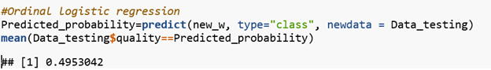
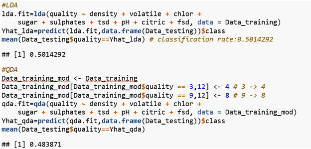
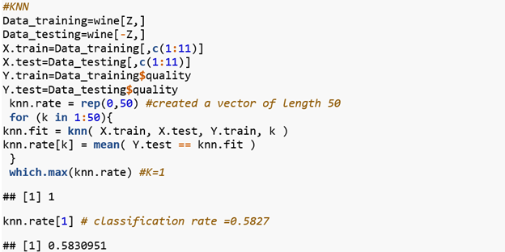
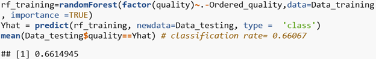
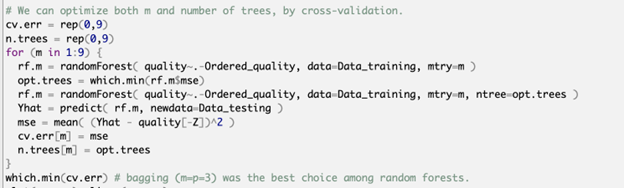
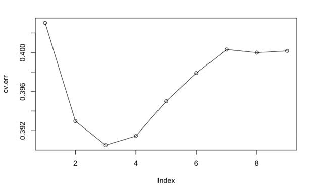
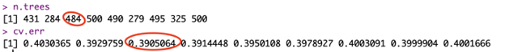
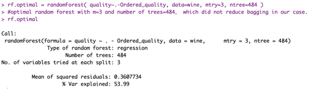
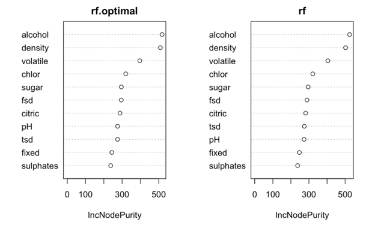

## Research Question---Purpose & Interest
We are interested in analyzing the white_wine dataset for predicting the level of wine quality score. The independent variables, in this case, are quantitative, including residual sugar, alcohol, and density, etc.   This dataset was created by P. Cortez, A. Cerdeira, F. Almeida, T. Matos and J. Reis. in their article “Modeling wine preferences by data mining from physicochemical properties”. 

## Initial Model
Wine Quality is an ordered factor response variable, using Ordinal Multinomial Model is first preliminary choice. 

## VIF
After conducting a VIF test, we find multicollinearity, which means some predictors are not independent, as two variables (tsd & pH) have VIF exceed 10. 

## Stepwise Variables Selection
Two non-significant variables could be removed from the model. 

The classification rate of the ordinal logistic regression model is $` 0.4953 `$ . 

## Linear and Quadratic Discriminant Analysis
Then, to further investigate, we performed both linear discriminant analysis and quadratic discriminant analysis. The Linear Discriminant Analysis for our model after stepwise model selection, which only include variable of density, volatile, chlor, sugar, sulphates, tsd, pH, citric, fsd. As predictors (p) > 1.

For the QDA, it is expected to perform similarly because these procedures only differ in their fitting procedures as logistic regression.

Because rating 3 and 9 have too few observations, so we group 3 to 4 and 9 to 8. the observations were generated from a normal distribution with uncorrelated predictors. The LDA procedure have a higher classification rate of 0.5014, while the QDA procedure give out result of classification rate = 0.4838. LDA is a much less flexible classifier than QDA, and has substantially lower variance. This can potentially lead to improved prediction performance

## KNN
We employed the K-nearest neighbors (KNN) method on the original wine dataset, and the cross-validation to find the the optimal neighbour is K=1 for the wine data set, the classification rate accordingly is 0.5827. This non-parametric method provides better prediction about the wine quality than the LDA method.

## Random Forest
From the Importance plot for the randomForest, the most importance variables are alcohol, density and volatile etc.

The random forest method gives out a much higher classification rate, which classification rate is 0.66067.

We optimized both m and number of trees by cross-validation. We got m=p=3.

Bagging (m=p=3) was the best choice among random forests.

We fit the model again with the optimized random forest but it did not reduce bagging.

